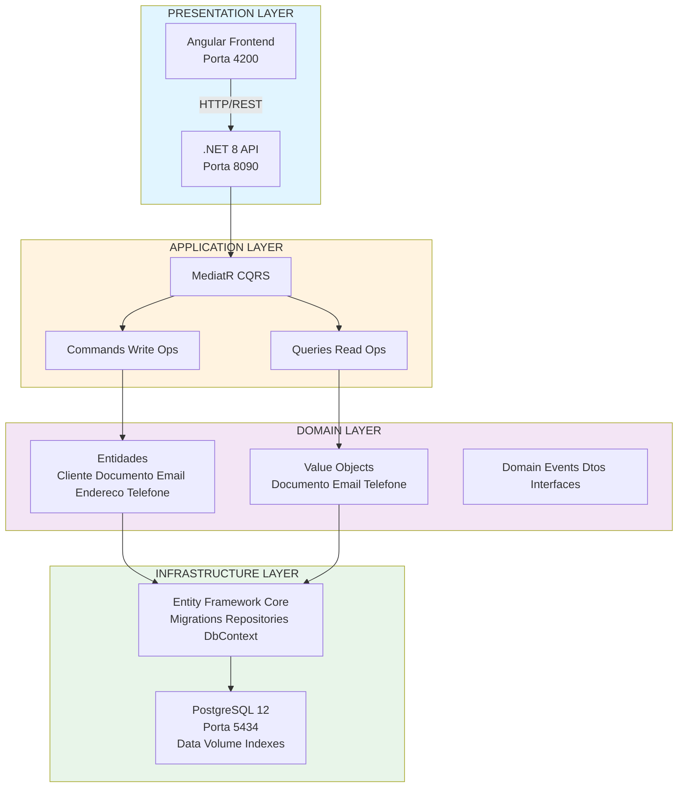
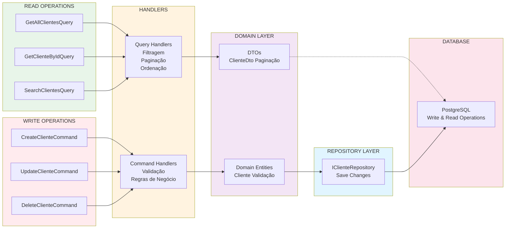
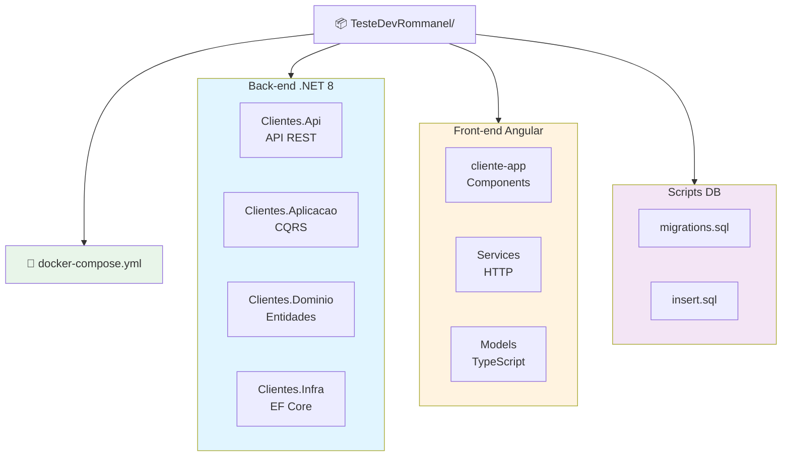

```markdown
# 📋 Sistema de Cadastro de Clientes - Teste Dev Rommanel

> Um sistema CRUD completo para gerenciamento de clientes (pessoas físicas e jurídicas) desenvolvido com **.NET 8**, **Angular 17+**, **PostgreSQL** e **Docker**, seguindo os princípios de **DDD** e **CQRS**.

## 🚀 Funcionalidades Principais

- ✅ Cadastro de pessoas físicas (CPF) e jurídicas (CNPJ)
- ✅ Validação de CPF/CNPJ com dígitos verificadores
- ✅ Validação de e-mail único no sistema
- ✅ Consulta com paginação, filtro e ordenação
- ✅ Atualização e exclusão (soft delete) de clientes
- ✅ Interface moderna em Angular com PrimeNG
- ✅ Documentação API com Swagger
- ✅ Containerizado com Docker Compose

## 📋 Índice

- [Visão Geral](#visão-geral)
- [Arquitetura](#arquitetura)
  - [Diagrama de Camadas DDD](#diagrama-de-camadas-ddd)
  - [Fluxo CQRS](#fluxo-cqrs)
- [Tecnologias Utilizadas](#tecnologias-utilizadas)
- [Pré-requisitos](#pré-requisitos)
- [Como Executar](#como-executar)
- [Estrutura do Projeto](#estrutura-do-projeto)
- [Regras de Negócio](#regras-de-negócio)
  - [Fluxo de Validação](#fluxo-de-validação)
- [API Endpoints](#api-endpoints)
- [Screenshots](#screenshots)
- [Comandos Docker Úteis](#comandos-docker-úteis)
- [Banco de Dados](#banco-de-dados)
- [Segurança](#segurança)
- [Performance](#performance)
- [Testes](#testes)
- [Contribuição](#contribuição)
- [Licença](#licença)
- [Desenvolvedor](#desenvolvedor)

---

## 🎯 Visão Geral

O sistema permite o cadastro, consulta, atualização e exclusão de clientes (pessoas físicas e jurídicas), com validações de CPF/CNPJ, e-mail único e regras específicas por tipo de pessoa.

### Principais Funcionalidades

- ✅ Cadastro de pessoas físicas e jurídicas
- ✅ Validação de CPF/CNPJ com dígitos verificadores
- ✅ Validação de e-mail único
- ✅ Consulta com paginação, filtro e ordenação
- ✅ Atualização e exclusão de clientes
- ✅ Interface intuitiva em Angular com PrimeNG

---

## 🏗️ Arquitetura

### Domain-Driven Design (DDD)

O projeto utiliza DDD para organizar o código em camadas bem definidas, garantindo separação de responsabilidades e manutenibilidade.

#### Diagrama de Camadas DDD



#### Fluxo CQRS



---

## 🛠️ Tecnologias Utilizadas

### Back-end

| Tecnologia | Versão | Descrição |
|------------|--------|-----------|
| .NET | 8.0 | Framework moderno de alto desempenho |
| Entity Framework Core | 8.0 | ORM para acesso ao banco de dados |
| PostgreSQL | 12 | Banco de dados relacional |
| MediatR | 12.0 | Implementação do padrão Mediator para CQRS |
| FluentValidation | 11.0 | Validação de modelos robusta |
| Ardalis.Result | 5.0 | Padronização de resultados |
| Swagger | - | Documentação da API |

### Front-end

| Tecnologia | Descrição |
|------------|-----------|
| Angular | 17+ Framework de desenvolvimento |
| PrimeNG | Biblioteca de componentes UI |
| Reactive Forms | Formulários reativos com validações |
| RxJS | Programação reativa |
| Bootstrap | Framework CSS |

### DevOps

| Tecnologia | Descrição |
|------------|-----------|
| Docker | Containerização da aplicação |
| Docker Compose | Orquestração de múltiplos containers |

---

## 📦 Pré-requisitos

- **Docker** (versão 20.10 ou superior)
- **Docker Compose** (versão 2.0 ou superior)
- **Git** (para clonar o repositório)

---

## 🚀 Como Executar

### Pré-requisitos

Antes de começar, certifique-se de ter instalado:

- ✅ **Docker** (versão 20.10 ou superior)
- ✅ **Docker Compose** (versão 2.0 ou superior)
- ✅ **Git** (para clonar o repositório)

### Passo a Passo

#### 1️⃣ Clone o repositório

```bash
git clone https://github.com/jacksonWiller/docker-angular-dotnet8-postgresql.git
cd TesteDevRommanel
```

#### 2️⃣ Inicie os containers

```bash
# Opção 1: Iniciar em background (recomendado)
docker-compose up -d

# Opção 2: Reconstruir as imagens antes de iniciar
docker-compose up --build -d
```

#### 3️⃣ Verifique o status

```bash
# Verificar se todos os serviços estão rodando
docker-compose ps

# Esperar alguns segundos para inicialização completa
sleep 10
```

#### 4️⃣ Acesse a aplicação

| Serviço | URL | Porta | Descrição |
|---------|-----|-------|-----------|
| 🎨 **Front-end** | http://localhost:4200 | 4200 | Aplicação Angular |
| 🔌 **API** | http://localhost:8090 | 8090 | API REST .NET 8 |
| 📚 **Swagger** | http://localhost:8090/swagger | 8090 | Documentação interativa |
| 🗄️ **PostgreSQL** | localhost:5434 | 5434 | Banco de dados |

#### 5️⃣ Teste a API

```bash
# Listar todos os clientes
curl http://localhost:8090/api/clientes

# Com paginação
curl "http://localhost:8090/api/clientes?pageNumber=1&pageSize=10"

# Com filtro por nome
curl "http://localhost:8090/api/clientes?filter=maria"

# Com ordenação
curl "http://localhost:8090/api/clientes?order=nome"
```

### 🐛 Troubleshooting

Se encontrar problemas:

```bash
# Ver logs de inicialização
docker-compose logs db-init

# Ver logs da API em tempo real
docker-compose logs -f api

# Reiniciar todos os serviços
docker-compose restart

# Limpeza completa (remove dados!)
docker-compose down -v
```

---

## 📁 Estrutura do Projeto

```
📦 TesteDevRommanel/
├── 📂 Back/                          # Back-end .NET 8
│   ├── 📂 Clientes.Api/             # API REST (EntryPoint)
│   │   ├── 📂 Controllers/          # Controladores HTTP
│   │   ├── 📂 Extensions/           # Extensões de configuração
│   │   ├── 📄 Program.cs            # Configuração da aplicação
│   │   ├── 📄 appsettings.json      # Configurações
│   │   └── 🐳 Dockerfile            # Configuração Docker
│   │
│   ├── 📂 Clientes.Aplicacao/       # Camada de Aplicação (CQRS)
│   │   ├── 📂 Commands/             # Commands (Write Operations)
│   │   │   ├── 📂 CreateCliente/
│   │   │   │   ├── 📄 Command.cs
│   │   │   │   ├── 📄 Handler.cs
│   │   │   │   └── 📄 Validator.cs
│   │   │   ├── 📂 UpdateCliente/
│   │   │   └── 📂 DeleteCliente/
│   │   │
│   │   ├── 📂 Queries/              # Queries (Read Operations)
│   │   │   ├── 📂 GetAllClientes/
│   │   │   │   ├── 📄 Query.cs
│   │   │   │   └── 📄 Handler.cs
│   │   │   └── 📂 GetClienteById/
│   │   │
│   │   └── 📄 ConfigureServices.cs  # Registro de serviços
│   │
│   ├── 📂 Clientes.Dominio/         # Camada de Domínio
│   │   ├── 📂 Entidades/            # Entidades de domínio
│   │   │   ├── 📄 Cliente.cs
│   │   │   ├── 📄 Documento.cs
│   │   │   ├── 📄 Email.cs
│   │   │   ├── 📄 Endereco.cs
│   │   │   └── 📄 Telefone.cs
│   │   │
│   │   ├── 📂 ObjetosDeValor/       # Value Objects
│   │   │   ├── 📄 Documento.cs
│   │   │   ├── 📄 Email.cs
│   │   │   ├── 📄 Telefone.cs
│   │   │   └── 📄 TipoDocumento.cs
│   │   │
│   │   ├── 📂 Dtos/                 # Data Transfer Objects
│   │   │   └── 📄 ClienteDto.cs
│   │   │
│   │   ├── 📂 Eventos/              # Domain Events
│   │   └── 📂 Interfaces/           # Interfaces de repositórios
│   │       └── 📄 IClienteRepository.cs
│   │
│   └── 📂 Clientes.Infra/           # Camada de Infraestrutura
│       ├── 📂 Contexto/             # DbContext EF Core
│       │   └── 📄 ClienteContext.cs
│       │
│       ├── 📂 Repositorio/          # Implementação de repositórios
│       │   └── 📄 ClienteRepository.cs
│       │
│       └── 📂 Scripts/              # Scripts de banco de dados
│           ├── 📄 migrations.sql    # Criação das tabelas
│           └── 📄 insert.sql        # Dados iniciais
│
├── 📂 Front/                         # Front-end Angular
│   └── 📂 cliente-app/
│       ├── 📂 src/
│       │   ├── 📂 app/
│       │   │   ├── 📂 components/   # Componentes Angular
│       │   │   │   ├── 📂 lista/           # Lista de clientes
│       │   │   │   ├── 📂 novo/            # Formulário de cadastro
│       │   │   │   ├── 📂 editar/          # Formulário de edição
│       │   │   │   ├── 📂 excluir/         # Modal de exclusão
│       │   │   │   └── 📂 detalhes/        # Detalhes do cliente
│       │   │   │
│       │   │   ├── 📂 services/   # Serviços HTTP
│       │   │   │   └── 📄 cliente.service.ts
│       │   │   │
│       │   │   └── 📂 models/     # Modelos TypeScript
│       │   │       └── 📄 cliente.model.ts
│       │   │
│       │   └── 📂 assets/         # Imagens e recursos estáticos
│       │
│       ├── 📄 angular.json        # Configuração do Angular
│       ├── 📄 package.json        # Dependências Node.js
│       ├── 📄 tsconfig.json       # Configuração TypeScript
│       └── 🐳 Dockerfile          # Configuração Docker
│
├── 📂 Scripts/                     # Scripts de inicialização
│   ├── 📄 migrations.sql          # Criação do banco de dados
│   └── 📄 insert.sql              # Dados iniciais
│
├── 📂 data2/                       # Volume do PostgreSQL
│   └── 🗄️ (dados do banco)
│
├── 🐳 docker-compose.yml           # Orquestração Docker
├── 📄 README.md                    # Documentação
└── 📄 .gitignore                   # Ignorar arquivos
```

### 📊 Visão Geral da Estrutura



---

## 📊 Regras de Negócio

### 1️⃣ Validação de Documentos

| Tipo | Formato | Validação | Restrição |
|------|---------|-----------|-----------|
| **CPF** | `000.000.000-00` | Dígitos verificadores | Único no sistema |
| **CNPJ** | `00.000.000/0000-00` | Dígitos verificadores | Único no sistema |

### 2️⃣ Validação por Tipo de Pessoa

#### 👤 Pessoa Física (CPF)

```
✅ Idade mínima: 18 anos
✅ Campos obrigatórios:
   - Nome completo
   - CPF válido
   - Telefone
   - E-mail único
   - Endereço completo (CEP, Logradouro, Número, Bairro, Cidade, Estado)
❌ Campos opcionais:
   - Inscrição Estadual
   - Isento
```

#### 🏢 Pessoa Jurídica (CNPJ)

```
✅ Campos obrigatórios:
   - Razão Social
   - CNPJ válido
   - Telefone
   - E-mail único
   - Endereço completo
✅ Obrigatório UM dos dois:
   - Inscrição Estadual OU
   - Isento de Inscrição Estadual
```

### 3️⃣ Validação de Unicidade

| Campo | Regra | Mensagem de Erro |
|-------|-------|------------------|
| 📧 **E-mail** | Não pode repetir | "E-mail já cadastrado!" |
| 📄 **Documento** | Não pode repetir | "Documento já cadastrado!" |

### 4️⃣ Campos Obrigatórios

| Campo | Pessoa Física | Pessoa Jurídica | Validação |
|-------|---------------|-----------------|-----------|
| Nome / Razão Social | ✅ | ✅ | Não vazio, máx 100 chars |
| Documento (CPF/CNPJ) | ✅ | ✅ | Formato + Dígitos verificadores |
| Telefone | ✅ | ✅ | Formato (XX) XXXXX-XXXX |
| E-mail | ✅ | ✅ | Formato válido + Único |
| CEP | ✅ | ✅ | Formato 00000-000 |
| Logradouro | ✅ | ✅ | Não vazio |
| Número | ✅ | ✅ | Não vazio |
| Bairro | ✅ | ✅ | Não vazio |
| Cidade | ✅ | ✅ | Não vazio |
| Estado | ✅ | ✅ | 2 caracteres |
| Inscrição Estadual | ❌ | ✅ OU Isento | - |
| Isento | ❌ | ✅ OU IE | Boolean |

### 5️⃣ Regras de Negócio Adicionais

| Regra | Descrição | Implementação |
|-------|-----------|---------------|
| 🔒 **Soft Delete** | Cliente não é excluído fisicamente | Flag `Removido = true` |
| 📜 **Auditoria** | Dados históricos mantidos | Consultas filtram `Removido = false` |
| ✉️ **E-mail** | Validação de formato | Regex pattern |
| 📞 **Telefone** | Validação de formato | Máscara (XX) XXXXX-XXXX |
| 🎂 **Idade** | Pessoa física ≥ 18 anos | Cálculo baseado em DataNascimento |
| ⚖️ **IE/Isento** | PJ precisa de um dos dois | Validação cruzada |

### 6️⃣ Fluxo de Validação

```mermaid
flowchart TD
    A[📝 NOVO CLIENTE] --> B{1. Tipo de Documento?}
    B -->|CPF| C[2. Validar CPF<br/>9 dígitos + 2 verificadores]
    B -->|CNPJ| D[2. Validar CNPJ<br/>14 dígitos + 2 verificadores]
    
    C --> E{3. Documento Único?}
    D --> E
    E -->|Sim| F{4. E-mail Único?}
    E -->|Não| G[❌ Erro: Documento já cadastrado]
    
    F -->|Sim| H{5. Idade ≥ 18 anos?<br/>(se CPF)}
    F -->|Não| I[❌ Erro: E-mail já cadastrado]
    
    H -->|Sim| J{6. Campos Obrigatórios?}
    H -->|Não| K[❌ Erro: Menor de 18 anos]
    
    J -->|Sim| L{7. PJ precisa IE ou Isento?}
    J -->|Não| M[❌ Erro: Campos obrigatórios]
    
    L -->|Sim| N[✅ Cliente Cadastrado]
    L -->|Não| O[❌ Erro: IE ou Isento obrigatório]
    
    style A fill:#e3f2fd
    style N fill:#c8e6c9
    style G fill:#ffcdd2
    style I fill:#ffcdd2
    style K fill:#ffcdd2
    style M fill:#ffcdd2
    style O fill:#ffcdd2
```

---

## 🔌 API Endpoints

### 📋 Endpoints Disponíveis

| Método | Endpoint | Descrição | Autenticação |
|--------|----------|-----------|--------------|
| **GET** | `/api/clientes` | Listar clientes (paginado) | ❌ |
| **GET** | `/api/clientes/{id}` | Buscar cliente por ID | ❌ |
| **GET** | `/api/clientes/by-nome/{nome}` | Buscar por nome | ❌ |
| **GET** | `/api/clientes/by-documento/{documento}` | Buscar por CPF/CNPJ | ❌ |
| **GET** | `/api/clientes/by-email/{email}` | Buscar por e-mail | ❌ |
| **POST** | `/api/clientes` | Criar novo cliente | ❌ |
| **PUT** | `/api/clientes/{id}` | Atualizar cliente | ❌ |
| **DELETE** | `/api/clientes/{id}` | Excluir cliente (soft) | ❌ |

### 🔍 Consulta com Paginação

```
GET /api/clientes?pageNumber=1&pageSize=10&filter=maria&order=nome
```

| Parâmetro | Tipo | Obrigatório | Padrão | Máximo | Descrição |
|-----------|------|-------------|--------|--------|-----------|
| `pageNumber` | int | ❌ | 1 | - | Número da página |
| `pageSize` | int | ❌ | 10 | 100 | Registros por página |
| `filter` | string | ❌ | - | - | Termo de busca (nome) |
| `order` | string | ❌ | - | - | Campo para ordenação |
| `orderDirection` | string | ❌ | asc | asc/desc | Direção da ordenação |

### 💡 Exemplos de Uso

#### 1️⃣ Listar Todos os Clientes

```bash
curl http://localhost:8090/api/clientes
```

**Resposta:**
```json
{
  "data": [
    {
      "id": "c1d2e3f4-a5b6-7890-c1d2-e3f4a5b67890",
      "nome": "Maria Silva",
      "documento": "123.456.789-00",
      "tipoDocumento": 1,
      "dataNascimento": "1985-06-15T00:00:00+00:00",
      "telefone": "(11) 98765-4321",
      "email": "maria.silva@email.com",
      "cep": "01001-000",
      "logradouro": "Praça da Sé",
      "numero": "123",
      "bairro": "Sé",
      "cidade": "São Paulo",
      "estado": "SP",
      "inscricaoEstadual": "",
      "isento": true
    }
  ],
  "pagination": {
    "totalRecords": 11,
    "pageNumber": 1,
    "pageSize": 10,
    "totalPages": 2
  }
}
```

#### 2️⃣ Listar com Paginação

```bash
curl "http://localhost:8090/api/clientes?pageNumber=2&pageSize=5"
```

#### 3️⃣ Buscar com Filtro

```bash
curl "http://localhost:8090/api/clientes?filter=maria"
```

#### 4️⃣ Buscar com Ordenação

```bash
curl "http://localhost:8090/api/clientes?order=nome&orderDirection=desc"
```

#### 5️⃣ Criar Cliente (Pessoa Física)

```bash
curl -X POST http://localhost:8090/api/clientes \
  -H "Content-Type: application/json" \
  -d '{
    "nome": "João Souza",
    "documento": "11122233344",
    "dataNascimento": "1990-05-20",
    "telefone": "(11) 99999-8888",
    "email": "joao.souza@email.com",
    "inscricaoEstadual": "",
    "isento": true,
    "endereco": {
      "cep": "01002-000",
      "logradouro": "Avenida Paulista",
      "numero": "1000",
      "bairro": "Bela Vista",
      "cidade": "São Paulo",
      "estado": "SP"
    }
  }'
```

**Resposta de Sucesso:**
```json
{
  "success": true,
  "data": {
    "id": "new-guid-here",
    "message": "Cliente cadastrado com sucesso!"
  }
}
```

#### 6️⃣ Criar Cliente (Erro de Validação)

**Resposta de Erro:**
```json
{
  "success": false,
  "errors": [
    {
      "fieldName": "Documento",
      "errorMessage": "CPF inválido!"
    },
    {
      "fieldName": "Email",
      "errorMessage": "E-mail já cadastrado!"
    }
  ]
}
```

#### 7️⃣ Atualizar Cliente

```bash
curl -X PUT http://localhost:8090/api/clientes/c1d2e3f4-a5b6-7890-c1d2-e3f4a5b67890 \
  -H "Content-Type: application/json" \
  -d '{
    "nome": "Maria Silva Souza",
    "documento": "123.456.789-00",
    "dataNascimento": "1985-06-15",
    "telefone": "(11) 98765-4321",
    "email": "maria.souza@email.com",
    "inscricaoEstadual": "",
    "isento": true,
    "endereco": {
      "cep": "01001-000",
      "logradouro": "Praça da Sé",
      "numero": "456",
      "bairro": "Sé",
      "cidade": "São Paulo",
      "estado": "SP"
    }
  }'
```

#### 8️⃣ Excluir Cliente (Soft Delete)

```bash
curl -X DELETE http://localhost:8090/api/clientes/c1d2e3f4-a5b6-7890-c1d2-e3f4a5b67890
```

**Resposta:**
```json
{
  "success": true,
  "message": "Cliente removido com sucesso!"
}
```

### 📊 Estrutura do Cliente

```typescript
interface Cliente {
  id: string;                    // UUID
  nome: string;                  // Nome ou Razão Social
  documento: string;             // CPF/CNPJ formatado
  tipoDocumento: number;         // 1 = CPF, 2 = CNPJ
  dataNascimento: Date;          // Data de nascimento (PJ tem data de criação)
  telefone: string;              // (XX) XXXXX-XXXX
  email: string;                 // e-mail único
  cep: string;                   // 00000-000
  logradouro: string;            // Rua, Av, etc
  numero: string;                // Número do endereço
  bairro: string;                // Bairro
  cidade: string;                // Cidade
  estado: string;                // UF (2 caracteres)
  inscricaoEstadual: string;     // IE (opcional PF, obrigatório OU isento PJ)
  isento: boolean;               // Isento de IE
}
```

### 🔑 Tipos de Documento

| Valor | Tipo | Descrição |
|-------|------|-----------|
| `1` | CPF | Pessoa Física |
| `2` | CNPJ | Pessoa Jurídica |

---

## 📸 Screenshots

### Back-end - Swagger UI


**Figura 1:** Documentação interativa da API REST com Swagger UI, mostrando os endpoints disponíveis para gerenciamento de clientes.

### Front-end - Tela de CRUD


**Figura 2:** Interface do sistema de cadastro de clientes em Angular com PrimeNG, exibindo a lista de clientes com opções de criar, editar e excluir.

---

## 🐳 Comandos Docker Úteis

### Iniciar/Parar/Reiniciar

```bash
# Iniciar todos os serviços
docker-compose up -d

# Parar todos os serviços
docker-compose down

# Reiniciar serviços
docker-compose restart

# Parar e remover volumes (limpeza completa)
docker-compose down -v
```

### Logs

```bash
# Ver logs de todos os serviços
docker-compose logs

# Ver logs em tempo real
docker-compose logs -f

# Ver logs de um serviço específico
docker-compose logs -f api
docker-compose logs -f frontend
docker-compose logs -f postgres
```

### Executar comandos nos containers

```bash
# Acessar o container da API
docker-compose exec api bash

# Acessar o container do PostgreSQL
docker-compose exec postgres psql -U postgres -d postgres

# Executar migrations no banco
docker-compose exec api dotnet ef database update
```

### Ver status dos containers

```bash
# Ver todos os containers
docker-compose ps

# Ver imagens Docker
docker images

# Ver volumes
docker volume ls
```

---

## 🗄️ Banco de Dados

### Estrutura do Banco

```
┌─────────────────────────────────────────────────────────────┐
│                        Clientes                              │
├─────────────────────────────────────────────────────────────┤
│ Id (PK)          │ UUID                                      │
│ Nome             │ VARCHAR                                   │
│ DocumentoId (FK) │ UUID → Documento.Id                       │
│ DataNascimento   │ TIMESTAMP                                 │
│ TelefoneId (FK)  │ UUID → Telefone.Id                        │
│ EmailId (FK)     │ UUID → Email.Id                           │
│ EnderecoId (FK)  │ UUID → Endereco.Id                        │
│ InscricaoEstadual│ VARCHAR                                   │
│ Isento           │ BOOLEAN                                   │
│ Removido         │ BOOLEAN (Soft Delete)                     │
└─────────────────────────────────────────────────────────────┘

┌─────────────────────────────────────────────────────────────┐
│                        Documento                             │
├─────────────────────────────────────────────────────────────┤
│ Id      (PK) │ UUID                                        │
│ Numero       │ VARCHAR (CPF/CNPJ)                          │
│ Tipo         │ INTEGER (1=CPF, 2=CNPJ)                     │
└─────────────────────────────────────────────────────────────┘

┌─────────────────────────────────────────────────────────────┐
│                          Email                               │
├─────────────────────────────────────────────────────────────┤
│ Id       (PK) │ UUID                                        │
│ Endereco      │ VARCHAR (e-mail)                            │
└─────────────────────────────────────────────────────────────┘

┌─────────────────────────────────────────────────────────────┐
│                        Endereco                              │
├─────────────────────────────────────────────────────────────┤
│ Id         (PK) │ UUID                                      │
│ Cep           │ VARCHAR                                     │
│ Logradouro    │ VARCHAR                                     │
│ Numero        │ VARCHAR                                     │
│ Bairro        │ VARCHAR                                     │
│ Cidade        │ VARCHAR                                     │
│ Estado        │ VARCHAR (2 caracteres)                      │
└─────────────────────────────────────────────────────────────┘

┌─────────────────────────────────────────────────────────────┐
│                        Telefone                              │
├─────────────────────────────────────────────────────────────┤
│ Id       (PK) │ UUID                                        │
│ Numero        │ VARCHAR (formato (XX) XXXXX-XXXX)           │
└─────────────────────────────────────────────────────────────┘
```

### Dados Iniciais

O sistema vem com dados de exemplo para testes:
- **5 pessoas físicas** (CPF)
- **6 pessoas jurídicas** (CNPJ)
- **18 e-mails** cadastrados
- **16 endereços** em diferentes cidades do Brasil
- **16 telefones** com DDDs variados

---

## 🔐 Segurança

- ✅ Validação de entrada em todos os endpoints
- ✅ Sanitização de dados
- ✅ Proteção contra SQL Injection (via EF Core)
- ✅ CORS configurado para desenvolvimento
- ✅ HTTPS configurado para produção

---

## 📈 Performance

- ✅ Paginação de resultados (evita carregamento de muitos dados)
- ✅ Query optimization com `AsNoTracking()` para leituras
- ✅ Indexação nas chaves estrangeiras
- ✅ Connection pooling do Npgsql
- ✅ Lazy loading desativado para controle explícito

---

## 🧪 Testes

### Testes Unitários (Back-end)

```bash
# Navegue até a pasta de testes
cd Back/ClienteTeste

# Execute os testes
dotnet test
```

### Testes E2E (Front-end)

```bash
# Navegue até a pasta do front-end
cd Front/cliente-app

# Execute os testes
ng test
```

